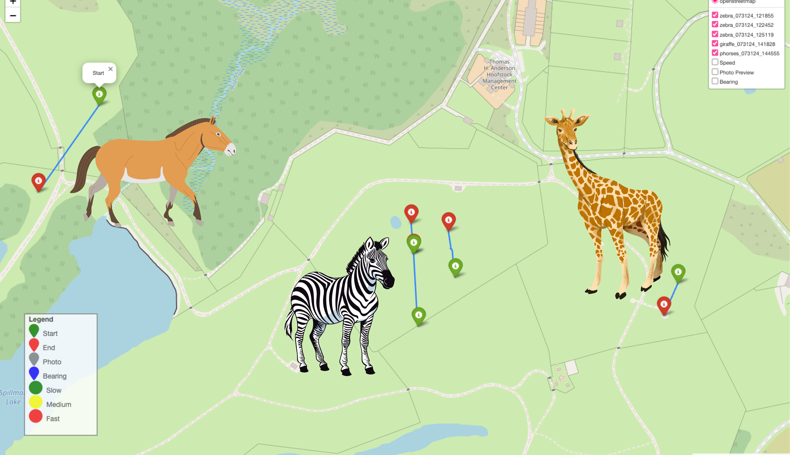

# WildWing [](https://doi.org/10.5281/zenodo.14902303)

An open-source, autonomous and affordable UAS for animal behaviour video monitoring using Parrot Anafi drones to track group-living animals.

**Tags:** Animal-Ecology, AI4CI, Software


### License
[](https://opensource.org/licenses/MIT)

## References
- **Paper:** [WildWing: An open-source, autonomous and affordable UAS for animal behaviour video monitoring](https://doi.org/10.1111/2041-210X.70018)
- **Dataset:** [WildWing deployment data](https://doi.org/10.5281/zenodo.14838100)
- **Control Software:** [SoftwarePilot](https://github.com/KevynAngueira/SoftwarePilot/)
- **Video Analysis Tools:** [KABR tools](https://github.com/Imageomics/kabr-tools) for automatic behavior labeling
- **Field Deployment Guide:** [WildWing wiki](wiki.md) - Detailed instructions for in-field operations and deployment phases
- **Key Terms:**
  - **UAS:** Unmanned Aerial System
  - **YOLO:** Computer vision model for object detection
  - **Autonomous Navigation Policy:** Algorithm that analyzes video frames and determines drone commands

## Acknowledgements

T his work was supported by the National Science Foundation (NSF) funded AI institute for Intelligent Cyberinfrastructure with Computational Learning in the Environment ([ICICLE](https://icicle.osu.edu/)) under [OAC #2112606](https://www.nsf.gov/awardsearch/showAward?AWD_ID=2112606).

This work was also supported by the [Imageomics Institute](https://imageomics.org), which is funded by the US National Science Foundation's Harnessing the Data Revolution (HDR) program under [Award #2118240](https://www.nsf.gov/awardsearch/showAward?AWD_ID=2118240) (Imageomics: A New Frontier of Biological Information Powered by Knowledge-Guided Machine Learning). 

The data was gathered at [The Wilds](https://www.thewilds.org/), a private, non-profit conservation center located on nearly 10,000 acres of reclaimed coal mine land in southeastern Ohio, conducted under approval by the The Wilds Science Committee.

## Issue reporting
Please report issues through GitHub issues in this repository. For additional support, refer to the [WildWing wiki](wiki.md) for troubleshooting guidance.

---

# Tutorials

## Getting Started with WildWing

### Prerequisites
- **Hardware:** [Parrot Anafi drone](https://www.parrot.com/en/drones/anafi) with controller
- **Operating System:** Ubuntu 22.04.4 OS on x86_64 architecture
- **Software:** [VLC media player](https://www.videolan.org/), text editor (nano, emacs, vi, or VSCode)
- **Optional:** Smartphone with [FreeFlight 6](https://apps.apple.com/us/app/freeflight-6/id1386165299) app

### Complete Setup and First Mission

**Step 1: Environment Setup**
```bash
# Create conda environment (one-time setup)
conda create --name wildwing --file requirements.txt
```

**Step 2: Hardware Connection**
1. Power on the Parrot Anafi drone and Skycontroller
2. Connect drone to controller using USB-A to USB-C cable
3. Wait for blue LED on controller, then disconnect cable
4. Connect controller to laptop via USB-C cable
5. Open VLC Media Player → Media → Open network stream
6. Enter network URL: `rtsp://192.168.53.1/live`

**Step 3: Configure Mission Parameters**
Edit the following files to customize your mission:
- `controller.py`: Set `DURATION` (number of tracking sections)
- `navigation.py`: Adjust movement distances (`x_dist`, `y_dist`, `z_dist`)

**Step 4: Launch Your First Mission**
```bash
./launch.sh
```

**Step 5: Monitor and Control**
- Watch drone's point-of-view via VLC livestream
- Monitor YOLO output in `/missions/mission_record_YYYYMMDD_HHMMSS/`
- Check logs in `/log/outputs_YYYYMMDD_HHMMSS.log`
- Use handheld controller for manual altitude adjustments if needed

**Expected Results:**
- Autonomous animal tracking with recorded video data
- Telemetry logs and YOLO detection outputs
- Mission data ready for behavioral analysis

---

# How-To Guides

## Continuing Multi-Session Missions

**Problem:** You want to continue tracking without landing the drone between sessions.

**Solution:**
1. Comment out the takeoff line in `controller.py`:
```python
# drone.piloting.takeoff()
```
2. Save the file
3. Run `./launch.sh` to start the new mission segment

## Customizing Flight Behavior for Different Species

**Problem:** Different animals require different tracking approaches and flight patterns.

**Adjustments in `navigation.py`:**
- **Large, slow animals (elephants, giraffes):** Increase `x_dist_no_subject` for wider search patterns
- **Fast-moving herds (zebras, wildebeest):** Reduce `x_dist`, `y_dist` for tighter tracking
- **Species or group sensitive to noise:** Increase `z_dist` for higher altitude operation

**Weather Considerations:**
- **Windy conditions:** Reduce all distance parameters by 20-30%
- **Poor visibility:** Decrease `DURATION` for shorter, more manageable sessions

## Analyzing Mission Data

**Problem:** You have collected mission data and need to extract behavioral insights.

**Steps:**
1. Navigate to mission folder: `/missions/mission_record_YYYYMMDD_HHMMSS/`
2. Use the provided [data analysis notebook](data_analysis.ipynb) for telemetry analysis
3. For behavior labeling, process video files with [KABR tools](https://github.com/Imageomics/kabr-tools)
4. Cross-reference YOLO detection outputs with video timestamps

**Troubleshooting:**
- **No video stream:** Check VLC network URL and drone connection
- **Poor tracking:** Verify lighting conditions and adjust YOLO confidence thresholds
- **Connection issues:** Restart controller connection and check USB cables

---

# Explanation

## System Architecture and Design Philosophy


### Core Components

The WildWing system consists of three integrated components designed for autonomous animal behavior monitoring:

**1. Parrot Anafi Drone Platform**
The Parrot Anafi was chosen for its balance of affordability, stability, and video quality. Its lightweight design and excellent stabilization make it ideal for wildlife observation where minimal disturbance is crucial.

**2. Open-Source Control Software**
Built on the SoftwarePilot framework, the control software serves as the bridge between computer vision analysis and drone commands. This design pattern separates concerns, allowing researchers to modify tracking algorithms without touching flight control code.

**3. GPU-Enabled Ground Station**
The laptop serves dual purposes: running computationally intensive YOLO models for real-time animal detection and providing a monitoring interface for researchers to oversee mission progress.

### Autonomous Navigation Philosophy

The navigation system employs a reactive approach rather than pre-programmed flight paths. This design choice enables:
- **Adaptive tracking:** The drone responds to animal movement in real-time
- **Flexible deployment:** No need for extensive pre-mission planning or GPS waypoint programming
- **Robust operation:** The system handles unexpected animal behavior gracefully

### Computer Vision Integration

YOLO (You Only Look Once) models provide the detection backbone because they offer:
- **Real-time processing:** Fast enough for responsive drone control
- **Versatile detection:** Can be trained on multiple species with minimal modification
- **Resource efficiency:** Runs effectively on laptop GPUs

### Why This Architecture Works

This distributed approach (drone + ground processing) was chosen over onboard processing because:
- **Computational power:** Laptop GPUs significantly outperform drone processors
- **Upgradability:** Easy to improve detection models without hardware changes
- **Cost effectiveness:** Leverages existing research computing resources
- **Real-time monitoring:** Researchers maintain situational awareness throughout missions



The system has been successfully deployed across diverse species and habitats, demonstrating its flexibility and effectiveness for behavioral ecology research. The open-source nature encourages community contributions and adaptations for specific research needs.