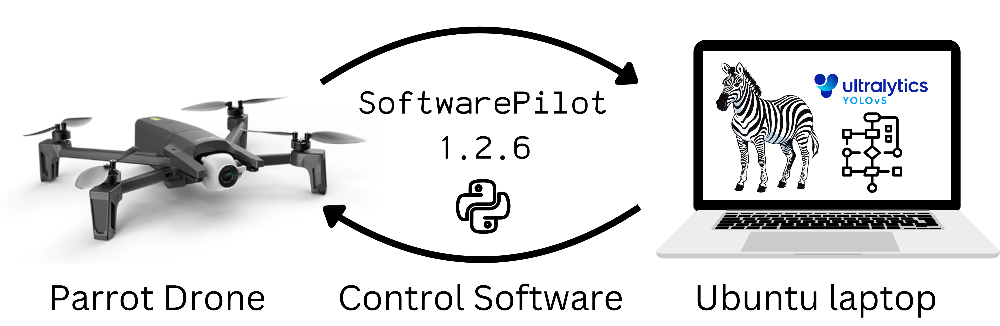
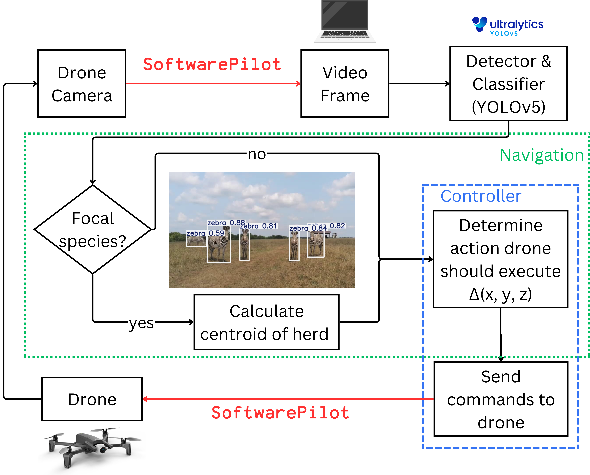

# wildwing
### Autonomous UAS Software for In Situ Imageomics Missions



#### This repo contains software to autonomously track group-living animals using Parrot Anafi drones.

## Instructions for use
#### Hardware Requirements
This tool requires a Parrot Anafi drone and its controller, and a laptop running Ubuntu 22.04.4 OS on 86_64 architecture. 

#### Software Requirements
See [requirements.txt](requirements.txt) for required packages.
See [SoftwarePilot](https://github.com/KevynAngueira/SoftwarePilot/) for details on the control software.
Optional: SmartPhone with [FreeFlight 6](https://apps.apple.com/us/app/freeflight-6/id1386165299) app to connect drone and controller.

### Step 1: Set-up hardware
- On the laptop, create conda environment using the [requirements.txt](requirements.txt) file by running the following command. Note: you only need to create this conda environment once.
  ```
  conda create --name wildwing --file requirements.txt
  ```
- Connect drone and controller. Power on the drone and the Parrot Skycontroller. Plug the drone and the controller together with an USB-A (controller) to USB-C (drone) cable. The LED light on the controller will turn blue once connected and you can unplug the controller from the drone. Optional: you may also follow the instructions in the FreeFlight app to connect the drone and controller. 
- Plug the controller into the laptop using USB-C cable.
- Using [VLC media player](https://www.videolan.org/), connect to drone live-stream. From the “Media” menu of VLC, select “Open network stream”. Enter “rtsp://192.168.53.1/live” in the Network URL field.
```
conda create --name wildwing --file requirements.txt
```
### Step 2: Initialize software parameters
Initialize the following parameters in the python scripts. You can use these parameters to customize the mission for specific weather conditions, species, and habitats.
- [controller.py](controller.py)
  - DURATION: number of sections to execute autonomous tracking mission
- [navigation.py](navigation.py)
  - x_dist: move +/- X meters in forward/backward plane
  - x_dist_no_subject: move +/- X meters forward if no subject detected
  - y_dist: move +/- X meters in left/right plane
  - z_dist: move +/- X meters in up/down plane

### Step 3: Launch drone
- Place drone in an area that is clear of obstructions
- Execute ./[launch.sh](launch.sh) from the command line. This will launch the drone, and initialize the log and telemetry files to record the mission data.
```
./launch.sh
```

- Optional: manually maneuver from to a higher altitude using hand-held controller

### Step 3: Monitor the system
- Monitor the drone's PoV using the VLC livestream
- Monitor the YOLO model output and telemetry data in /missions/mission_record_YYYYMMDD_HHMMSS/
- Check logs in /log/outputs_YYYYMMDD_HHMMSS.log

### Step 4: End mission
Once the mission duration is complete, you may continue the autonomous tracking mission, or land the drone using the remote controller.
To continue the mission without first landing, comment out line 111 in [controller.py](controller.py), shown below, and save the file. Run ./[launch.sh](launch.sh)from the terminal to start the new mission.

```
# drone.piloting.takeoff()
```

### Step 5: Analyze video data
This script saves the video recordings, telemetry data, and YOLO outputs for each mission. See the [WildWing HuggingFace data repo](https://huggingface.co/datasets/imageomics/wildwingdeployment) for example outputs.
To automatically label video data with behavior, we recommend using [KABR tools](https://github.com/Imageomics/kabr-tools).


## Overview of WildWing framework

Framework of the WildWing unmanned aerial system (UAS) autonomous navigation control logic


## Citation
If you use this repo in your work, please use this citation:
```
@software{wildwing2024
  author={Jenna Kline and Kevyn Irizarry and Alison Zhong},
  doi={},
  title={WildWing},
  year={2024},
  url={}
}
```

## Funding Acknowledgements
The [Imageomics Institute](https://imageomics.osu.edu/) is supported by the National Science Foundation Award No. 2118240.

The [ICICLE Institute](https://imageomics.osu.edu/) is funded by the National Science Foundation (NSF) under grant number OAC-2112606.
